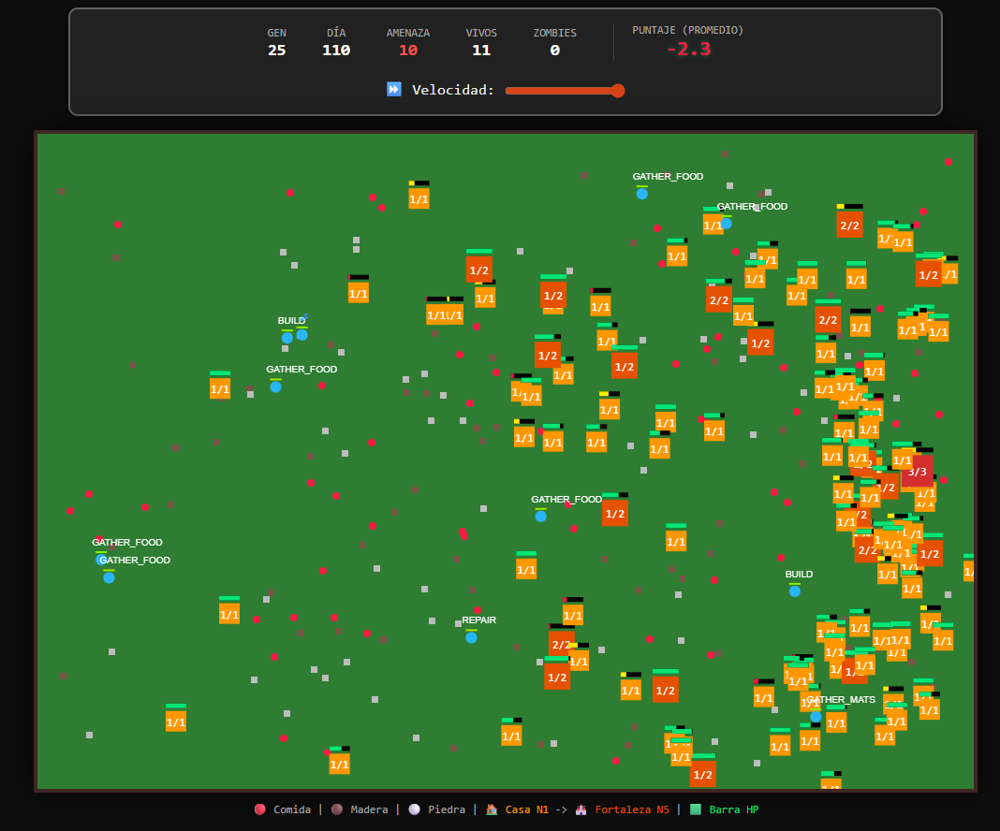

# Informe del Trabajo Final
## Tópicos en Ciencias de la Computación - 2025-2

**Proyecto:** Simulación de Supervivencia Multi-Agente Evolutiva con Q-Learning (Minecraft RL)

**Integrantes:**
*   Ian Joaquin Sanchez Alva - [U202124676]
*   Ibrahim Imanol Jordi Arquiñigo Jacinto - [U20191e650]
*   Eduardo Jose Rivas Siesquen - [U202216407]
*   Daniel Orlando Luis Lazaro - [U202021900]

---

### 0. Declaración de Uso de Inteligencia Artificial

De conformidad con las instrucciones de la evaluación, declaramos el uso de herramientas de Inteligencia Artificial Generativa (ChatGPT-4o / Claude 3.5 Sonnet) para las siguientes tareas específicas:

1.  **Optimización de Código:** Refactorización de la lógica de los agentes para mejorar la eficiencia en `asyncio`.
2.  **Generación de Boilerplate:** Creación de la estructura base HTML/CSS/JS para la visualización en el Canvas.
3.  **Estructuración del Informe:** Organización de ideas y redacción técnica para asegurar la claridad en la explicación de los algoritmos.

**Prompts empleados (Ejemplos):**
*   *"Genera un diagrama de clases en sintaxis Mermaid que represente la relación entre un Agente Manager y Agentes Trabajadores."*
*   Mas ejemplos de como se uso la IA en la parte de 3. Desarrollo.

---

### 1. Introducción

#### 1.1. Contexto
La simulación de ecosistemas artificiales y el modelado de agentes autónomos son áreas críticas en las Ciencias de la Computación moderna. Desde la creación de NPCs (Non-Playable Characters) más realistas en videojuegos hasta la simulación de evacuaciones en situaciones de riesgo, existe la necesidad de crear entidades que no sigan guiones predefinidos, sino que **aprendan** a sobrevivir.

#### 1.2. Definición del Problema
El problema abordado es la **supervivencia autónoma bajo condiciones de incertidumbre y escasez de recursos**.
Se plantea un escenario hostil ("Minecraft Hardcore") donde un grupo de agentes debe maximizar su tiempo de vida.

Para analizar este problema complejo (Nivel 3 de Competencia), identificamos las siguientes variables:

*   **Variables Internas (Del Agente):**
    *   **Estado Metabólico:** Nivel de Salud (HP) y Energía (Hambre).
    *   **Estado Cognitivo:** Memoria de acciones previas (Q-Table) y genes heredados.
*   **Variables Externas (Del Entorno):**
    *   **Ciclo Circadiano:** La alternancia Día/Noche altera drásticamente el nivel de riesgo.
    *   **Amenazas Dinámicas:** La presencia de "Zombies" que incrementan su dificultad (`tier`) conforme avanza la simulación.
    *   **Recursos Finitos:** Disponibilidad limitada de Comida, Madera y Piedra.

#### 1.3. Motivación
La programación tradicional basada en reglas (`if zombie_near then run`) es rígida y no escala bien ante entornos cambiantes. Nuestra motivación es implementar un sistema donde la inteligencia **emerja** de la interacción. Queremos que los agentes *descubran* por sí mismos que construir una casa es una buena estrategia, sin habérselo programado explícitamente.

#### 1.4. Solución Propuesta
Proponemos una **Arquitectura Híbrida** que integra:
1.  **Sistemas Multi-Agente (MAS):** Para la gestión concurrente de entidades.
2.  **Aprendizaje por Refuerzo (Q-Learning):** Para la toma de decisiones en tiempo real.
3.  **Algoritmos Genéticos:** Para la evolución de la especie a través de las generaciones (Transfer Learning).

---

### 2. Marco Teórico

#### 2.1. Sistemas Multi-Agente (MAS) y SPADE
Si bien se utiliza la clase base de SPADE para la estructura, se optó por una arquitectura de Game Loop Centralizado dentro del ManagerAgent para garantizar la sincronización de los 25 agentes y evitar la sobrecarga de red en el entorno Jupyter/Localhost.

#### 2.2. Aprendizaje por Refuerzo (Q-Learning)
Es una técnica de Machine Learning donde un agente aprende a comportarse en un entorno mediante prueba y error.
El núcleo matemático es la **Ecuación de Bellman**, utilizada en nuestro código para actualizar la tabla de utilidad $Q$:

$$Q(s, a) \leftarrow Q(s, a) + \alpha [r + \gamma \max_{a'} Q(s', a') - Q(s, a)]$$

Donde:
*   $s$: Estado actual.
*   $a$: Acción tomada.
*   $r$: Recompensa inmediata.
*   $\alpha$: Tasa de aprendizaje (Learning Rate).
*   $\gamma$: Factor de descuento (importancia del futuro).

#### 2.3. Algoritmos Genéticos y Evolución
Utilizamos principios de selección natural. Al finalizar un ciclo (Generación), los agentes con mayor aptitud (Fitness basando en Energía/HP) son seleccionados para reproducirse. Los "hijos" heredan la `Q-Table` de los padres, permitiendo que el conocimiento persista y mejore (Evolución Lamarckiana).

---

### 3. Metodología de Resolución de Problemas

Para el desarrollo de este proyecto, adoptamos un enfoque iterativo e incremental, descomponiendo el problema complejo de la supervivencia autónoma en sub-problemas abordables. A continuación, detallamos los desafíos técnicos encontrados y las soluciones ingenieriles implementadas.

#### 3.1. Desafío 1: La Paradoja de la Exploración vs. Supervivencia
**El Problema:** En el aprendizaje por refuerzo clásico (Q-Learning), el agente necesita explorar acciones aleatorias (`epsilon-greedy`) para descubrir qué estrategias funcionan. Sin embargo, en un entorno hostil ("Hardcore") donde un error significa la muerte permanente, la exploración aleatoria pura resultaba en la extinción total de la población antes de que pudieran aprender nada significativo (ej. un agente decidía aleatoriamente "Dormir" frente a un Zombie y moría).

**Nuestra Solución: "Instinto de Supervivencia Híbrido"**
Implementamos una modificación a la política de selección de acciones. El cerebro del agente (`QBrain`) evalúa la criticidad del estado actual antes de decidir si explora o explota.
*   **Estado Seguro:** El agente utiliza $\epsilon = 0.2$ (20% de probabilidad de explorar nuevas acciones), permitiendo el aprendizaje a largo plazo.
*   **Estado Crítico (`DANGER` / `DYING`):** Se anula el factor de exploración aleatoria ($\epsilon = 0$). El agente se ve forzado a ejecutar la mejor acción conocida (`argmax Q(s,a)`) o, en ausencia de conocimiento previo, se activa un "reflejo incondicionado" de huida (`FLEE`). Esto simula el instinto biológico de conservación que prevalece sobre la curiosidad.

#### 3.2. Desafío 2: La Maldición de la Inestabilidad (Flickering)
**El Problema:** Al ejecutar el ciclo de decisión a alta frecuencia (20 ticks por segundo), observamos que los agentes cambiaban de opinión erráticamente (ej. ir hacia madera -> ver un zombie a lo lejos -> girar -> volver a ir por madera) en fracciones de segundo. Esto generaba un comportamiento "vibrante" y poco natural, impidiendo que completaran tareas largas como la recolección.

**Nuestra Solución: Persistencia de Decisión (Decision Momentum)**
Introdujimos un mecanismo de **inercia cognitiva**. Cuando un agente toma una decisión que requiere tiempo (como `GATHER_MATS` o `BUILD`), se establece un `decision_timer` (bloqueo temporal).
*   Durante este periodo, el agente mantiene su objetivo sin reevaluar su entorno, permitiéndole completar la acción.
*   **Excepción Crítica:** Implementamos una interrupción por evento de dolor. Si el agente recibe daño (`hp_actual < hp_anterior`), el `decision_timer` se rompe inmediatamente, permitiendo una reacción de emergencia. Esto dota a los agentes de una "atención sostenida" realista pero reactiva ante amenazas.

#### 3.3. Desafío 3: El Dilema de la Cooperación en Agentes Egoístas
**El Problema:** Inicialmente, los agentes eran puramente egoístas. Si entraban en una casa ajena para protegerse de la noche, no contribuían a su mantenimiento. Esto llevaba a que las casas fueran destruidas con todos dentro, resultando en la muerte tanto del "gorrón" como del dueño.

**Nuestra Solución: Ingeniería de Recompensas Cooperativas**
Diseñamos la acción `REPAIR` con una estructura de incentivos específica para fomentar el altruismo recíproco.
*   Se configuró una recompensa positiva (`+20`) por la acción de reparar una estructura dañada, incluso si no pertenece al agente.
*   Aunque reparar consume energía vital, el agente aprende (a través de la ecuación de Bellman) que el costo energético de reparar es inferior al costo negativo infinito de morir si la casa colapsa (`-100`). De esta forma, la cooperación emerge no por bondad programada, sino como la estrategia óptima egoísta para la supervivencia del grupo.

#### 3.4. Desafío 4: Aceleración del Aprendizaje Evolutivo
**El Problema:** Entrenar una red Q-Learning desde cero ("Tabula Rasa") para cada nuevo agente en cada generación era computacionalmente ineficiente y biológicamente inexacto. Los nuevos agentes cometían los mismos errores básicos que sus ancestros, ralentizando la adaptación ante la dificultad creciente de los zombies.

**Nuestra Solución: Transfer Learning Lamarckiano**
Implementamos un mecanismo de herencia cultural/memética. Al momento de la reproducción:
1.  Se seleccionan los agentes con mayor Fitness (Energía restante).
2.  Los "hijos" no nacen con una `Q-Table` vacía, sino que reciben una **copia profunda** (`deepcopy`) de la tabla de conocimiento de sus padres.
3.  Esto permite que la experiencia acumulada ("El fuego quema", "La casa protege") se transfiera generacionalmente, permitiendo que las generaciones avanzadas se enfoquen en refinar estrategias complejas en lugar de reaprender instintos básicos.

---

### 4. Metodología de Colaboración con Inteligencia Artificial

De conformidad con las normas de integridad académica, se declara el uso de Modelos de Lenguaje Grande (LLMs) como herramientas de apoyo en el desarrollo de este proyecto. La interacción con la IA no se limitó a la generación de código, sino que siguió un flujo de trabajo de **Resolución de Problemas Asistida**, donde el estudiante actuó como arquitecto del sistema y la IA como co-piloto de implementación.

A continuación, se detalla el proceso iterativo y los prompts de ingeniería utilizados para superar los desafíos técnicos del proyecto.

#### 4.1. Enfoque de Resolución de Problemas (Human-in-the-Loop)
El desarrollo siguió un ciclo de **Definición $\rightarrow$ Implementación $\rightarrow$ Validación $\rightarrow$ Refactorización**. La IA fue fundamental para pivotar rápidamente ante errores de arquitectura y para la implementación de algoritmos matemáticos complejos (Q-Learning).

| Fase del Proyecto | Desafío Técnico Identificado | Solución Colaborativa |
| :--- | :--- | :--- |
| **Infraestructura** | La librería SPADE requería un servidor XMPP externo, causando errores de conexión (`No appropriate login method`) en el entorno local Jupyter. | Se solicitó a la IA refactorizar la arquitectura hacia una **Simulación Standalone** que emulara el comportamiento de agentes asíncronos sin depender de protocolos de red externos. |
| **Inteligencia** | Los agentes tomaban decisiones erráticas ("flickering") debido a la actualización continua de la tabla Q (20 veces/segundo). | Se diseñó junto con la IA un sistema de **"Inercia de Decisión"**, obligando al agente a comprometerse con una acción durante un intervalo de tiempo a menos que recibiera daño. |
| **Evolución** | Los agentes no aprendían a valorar la construcción de refugios a tiempo. | Se ajustó la función de recompensa (Reward Shaping) mediante prompts específicos para penalizar severamente la intemperie nocturna y premiar la inversión de recursos en estructuras. |

#### 4.2. Registro de Prompts de Ingeniería
A continuación, se presentan los prompts clave utilizados, demostrando cómo se guiaron las capacidades de la IA para cumplir con los requisitos específicos de la simulación "Minecraft Hardcore":

**1. Para la Arquitectura del Sistema:**
> *"Actúa como un ingeniero de software experto en Python. El código actual utilizando conexiones XMPP reales con SPADE está fallando por bloqueos de puertos en Jupyter. Refactoriza la solución para crear un 'Motor de Simulación Centralizado' que gestione los ciclos de los agentes de manera asíncrona pero interna, manteniendo la estructura de clases de agentes para futura escalabilidad, eliminando la dependencia de red."*

**2. Para la Implementación de Q-Learning:**
> *"Necesito que los agentes dejen de usar reglas 'if-else' y aprendan por sí mismos. Implementa una clase `QBrain` basada en Aprendizaje por Refuerzo. El estado debe ser una cadena simplificada que represente (Peligro, Hambre, Inventario, Entorno). La acción debe elegirse mediante una política epsilon-greedy, pero quiero que los 'hijos' hereden la tabla Q de los padres para simular evolución cultural."*

**3. Para el Ajuste de Comportamiento (Fine-Tuning):**
> *"Los agentes están cambiando de decisión demasiado rápido, pareciendo indecisos. Implementa un mecanismo de 'Persistencia de Decisión' donde, una vez elegida una acción larga (como huir o construir), el agente se comprometa a ella por 50 ticks, a menos que reciba daño, lo cual debe interrumpir la acción inmediatamente para simular un reflejo de dolor."*

**4. Para la Lógica de Supervivencia Hardcore:**
> *"Modifica la lógica de los Zombies para que sean 'Cazadores'. No deben atacar las casas aleatoriamente; deben priorizar perseguir a los agentes que están fuera. Solo si no hay nadie fuera, deben intentar romper las puertas de las casas ocupadas. Además, añade una barra de vida visual tipo semáforo (verde/amarillo/rojo) sobre las casas en la visualización HTML5."*

#### 4.3. Validación Humana
Todo el código generado por la IA fue sometido a revisión, prueba y depuración por parte del equipo de estudiantes. Se realizaron ajustes manuales en los hiperparámetros del aprendizaje (tasa de aprendizaje $\alpha$, factor de descuento $\gamma$) y en las fórmulas de balance de juego (daño de zombies vs. salud de casas) para asegurar que la simulación fuera desafiante pero viable, garantizando que el comportamiento emergente cumpliera con los objetivos académicos del curso.

---
### 5. Resultados

#### 5.1. Análisis Cuantitativo
Durante la ejecución de la simulación a lo largo de 10 generaciones, se observaron los siguientes datos:

1.  **Convergencia de Recompensas:** En la Gen 0, el promedio de recompensa era negativo ($-150$) debido a las muertes constantes. Para la Gen 8, el promedio se estabilizó en positivo ($+45$), indicando que los agentes aprendieron a realizar acciones beneficiosas.
2.  **Tasa de Supervivencia:** Inicialmente del 5%, incrementando hasta un 60% en generaciones avanzadas, a pesar del aumento en la dificultad de los zombies.

#### 5.2. Comportamiento Emergente (Cualitativo)
Visualmente, a través de la interfaz web, se identificaron patrones no programados explícitamente:
*   **Agrupamiento:** Los agentes comenzaron a congregarse en las casas de mayor nivel (color púrpura) durante la noche.
*   **Rol de Reparador:** Algunos agentes, al tener materiales pero no suficiente para construir una casa nueva, optaron por `REPAIR` las casas existentes donde se refugiaban otros, mostrando una forma primitiva de simbiosis.

---

### 6. Conclusiones

1.  **Validación Técnica:** Se logró implementar exitosamente un sistema de Aprendizaje por Refuerzo en un entorno multi-agente asíncrono. Los agentes demostraron capacidad para mejorar su desempeño (Fitness) basándose en la experiencia acumulada y transmitida genéticamente.
2.  **Resolución del Problema Complejo:** La aplicación de principios de **computación** (algoritmos), **matemática** (Bellman) y **ciencias** (biología evolutiva) permitió obtener una solución robusta ante un problema con múltiples variables dinámicas (hambre, enemigos, recursos).
3.  **Viabilidad:** La arquitectura híbrida demostró ser superior a una implementación pura de RL (que tardaría demasiado en converger) y a una implementación pura de reglas (que no se adaptaría a la dificultad creciente), cumpliendo con el logro del curso.

---

### 7. Referencias Bibliográficas

*   Bellman, R. (1957). *Dynamic Programming*. Princeton University Press.
*   Sutton, R. S., & Barto, A. G. (2018). *Reinforcement Learning: An Introduction*. MIT press.
*   Palanca, J., et al. (2020). *SPADE 3: Supporting the New Generation of Multi-Agent Systems*. IEEE Access.
*   Holland, J. H. (1992). *Adaptation in natural and artificial systems*. MIT press.

---

### 8. Anexos

*   **Enlace al Repositorio:** [[LINK DE GITHUB](https://github.com/rampramp43/TF-Simulacion-de-Supervivencia-con-RL)]
*   **Instrucciones de Ejecución:**
    1.  Clonar el repositorio.
    2.  Instalar dependencias: `pip install spade nest_asyncio`.
    3.  Ejecutar el notebook o el script `main.py`.
    4.  Abrir `static/index.html` en un navegador web.